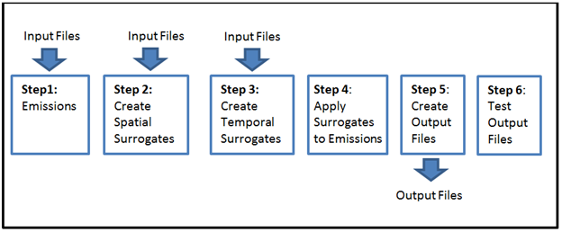
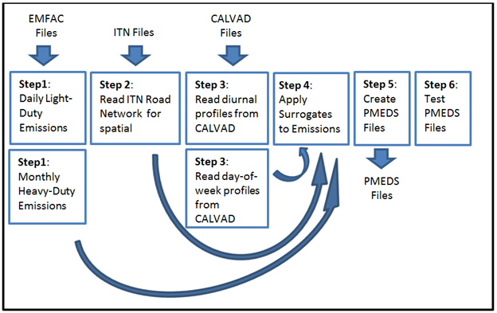

# ESTA USER Documentation

The purpose of this document is give a clear understanding of what ESTA is, and what it does. This is not meant as a guide to how to run ESTA, you will find that in the [User Guide](USERS_GUIDE.md).

## Introduction

The ESTA (Emissions Spatial and Temporal Allocator) model applies spatial and temporal surrogates to emissions to create top-down emission inventory files.  The model is very general and can apply spatial and/or temporal surrogates any kind of emissions file.  However, ESTA was originally developed with the goal of gridding on-road emissions as a replacement for the DTIM model.

## How It Works

ESTA is written in Python, using only free, open-source technology. It has a modular design to make it easier to upgrade, improve, and modify. It is a command-line program, executable on Linux, PC, or Mac. The flow of the code is easy to understand, there are six basic steps:

As shown in Figure 1, the ESTA work flow is straight forward. In the first step, emissions files are read into memory. In the second step, spatial distribution files are read and spatial surrogates are created. In the third step, temporal distribution files are read and the temporal surrogates are created. In the fourth step, the spatial and temporal surrogates are applied to the emissions and a gridded inventory is created in memory. In the fifth step, custom-formatted output files are created from the inventory. There is an optional sixth step, where quality assurance tests are run on the output files.

The above work flow is very general and can apply to gridding an on-road inventory, or any other kind of inventory. However, in practice, your work flow might be more complex. For instance, what if you want to read in multiple different kinds of temporal surrogates: diurnal and day-of-week? Or what if you want to read in several different types of emissions files? ESTA's modular design helps support these common types of work flow by allowing each box in Figure 1 to be replaced by a list of boxes / steps.

## Detailed Example - On-Road with EMFAC2014

To understand the ESTA structure and workflow better it might be helpful to look at an example simulation.

Figure 2 below shows the work flow for spatially gridding the on-road emissions from EMFAC2014. Notice that some of the steps are now repeated for different file types.

As shown in Figure 2, there are two implementations of the first "read emissions" step. This is because ARB reads monthly EMFAC files for Heavy-Duty Diesel emissions, but daily files for all other emissions. Being able to support reading two different kinds of input emissions files is important. The third step is also different, because ARB uses both diurnal and day-of-week temporal profiles from the California Vehicle Activity Database (CalVAD). In Step 4, only one module is needed to apply the surrogates to the emissions, and in step 5 has only one module use used to write output files. In step 6, the gridded, hourly emissions are summed and compared with the daily totals from EMFAC. We could also imagine wanting to write files of different formats, and thus wanting multiple boxes in that step as well.

ESTA is designed so that developers can create new versions of the steps above to fit their own unique problem.  This modularity allows developers to create new output files, read new input files, and change their work flow. To goal of ESTA is to link the workflow together with minimal fuss.

[Back to Main Readme](../README.md)

